# Lumina Finance

Lumina Finance is a self-hosted personal finance app for managing your finances, track expenses, set budgets, and perform analysis on your spending behaviour.

## DISCLAIMER

THIS APPLICATION IS PROVIDED “AS IS” AND “AS AVAILABLE,” WITHOUT WARRANTIES OF ANY KIND. THIS APPLICATION IS A SOFTWARE TOOL ONLY AND DOES NOT PROVIDE FINANCIAL, INVESTMENT, TAX, LEGAL, ACCOUNTING, OR OTHER PROFESSIONAL ADVICE. ANY CALCULATIONS, ESTIMATES, PROJECTIONS, SUMMARIES, OR OTHER OUTPUTS MAY BE INACCURATE OR INCOMPLETE AND SHOULD NOT BE RELIED ON AS A SUBSTITUTE FOR PROFESSIONAL JUDGMENT. YOU ARE SOLELY RESPONSIBLE FOR REVIEWING ALL OUTPUTS AND FOR ANY DECISIONS YOU MAKE. USE OF THIS APPLICATION IS AT YOUR OWN RISK.

## Screenshots

<!-- markdownlint-disable MD033 -->

  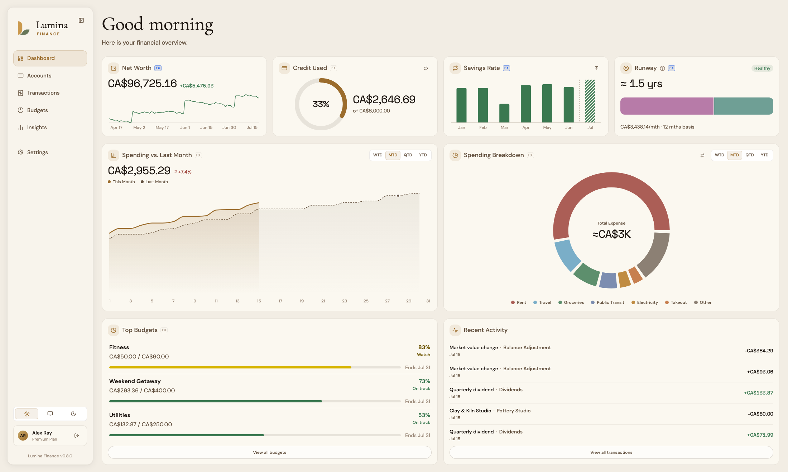
  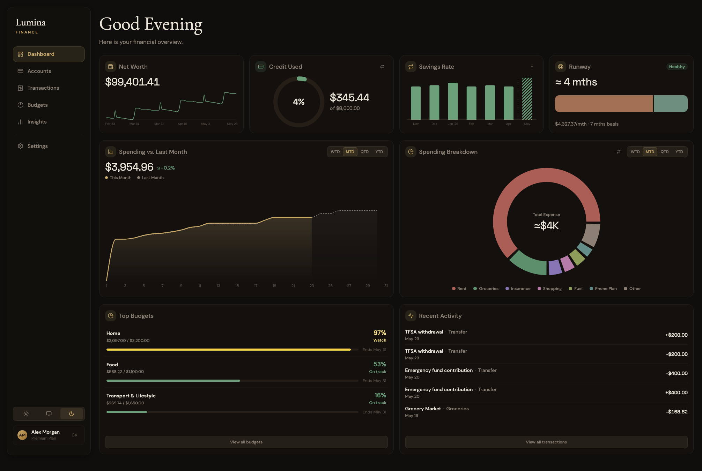

  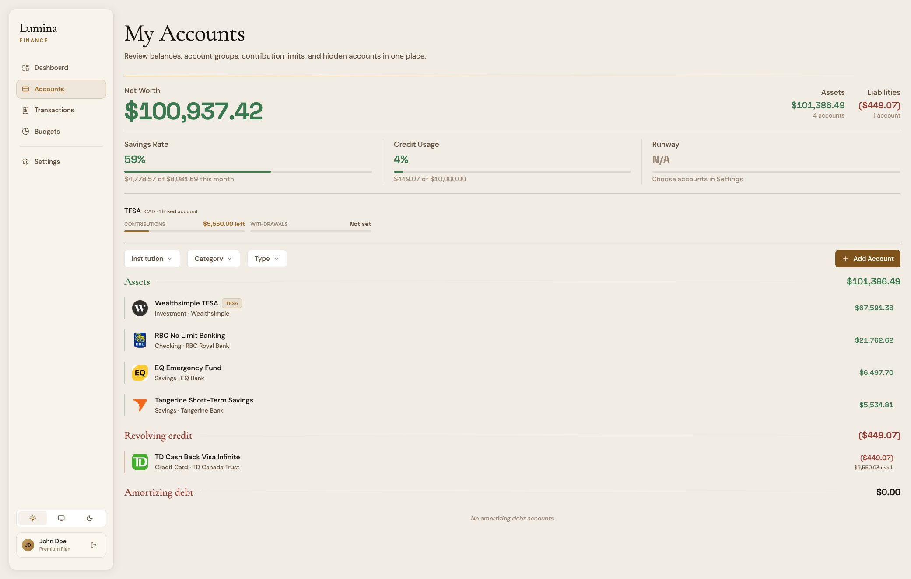
  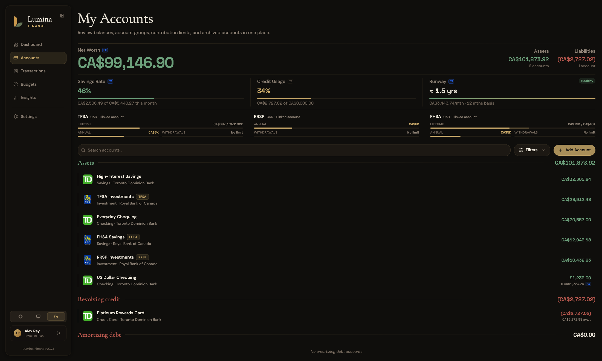

  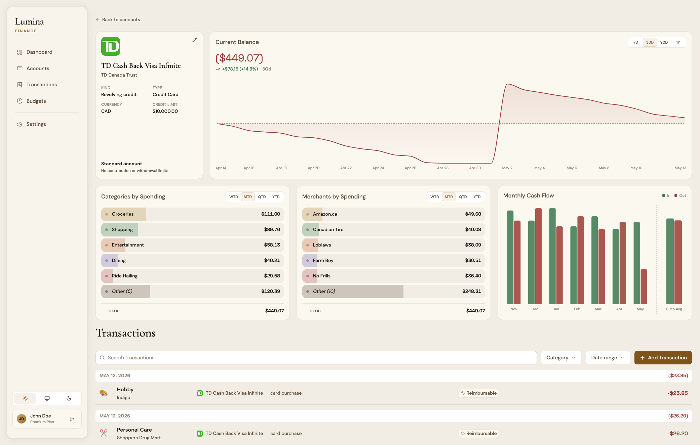
  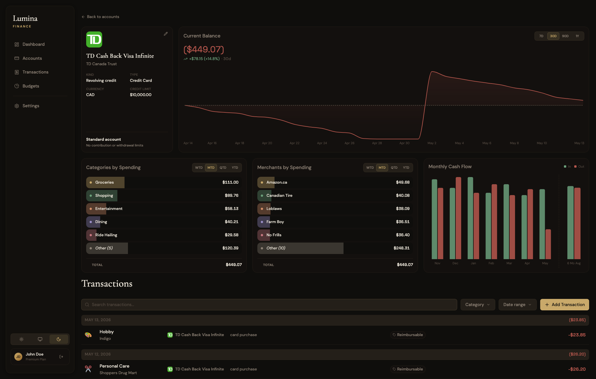

  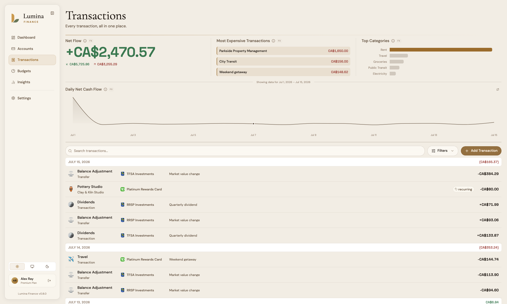
  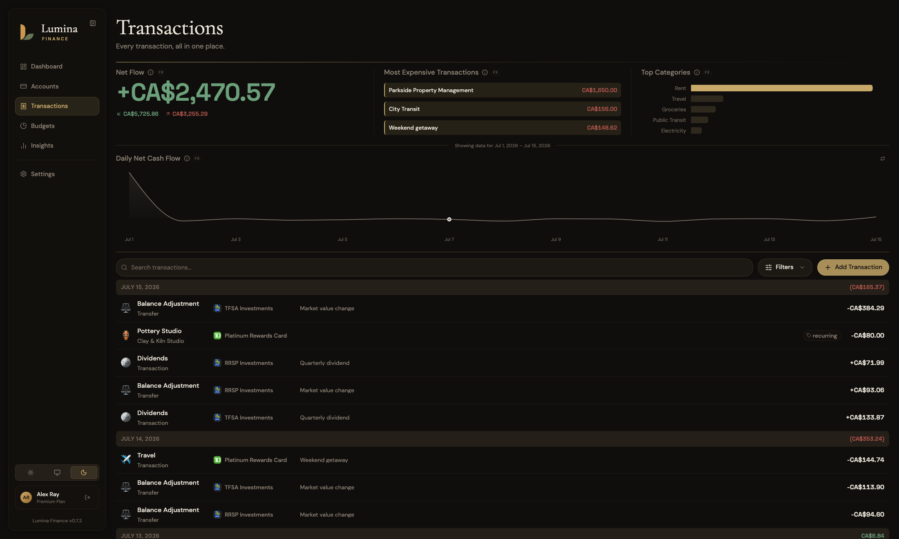

  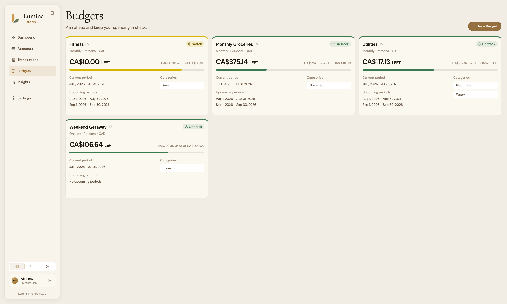
  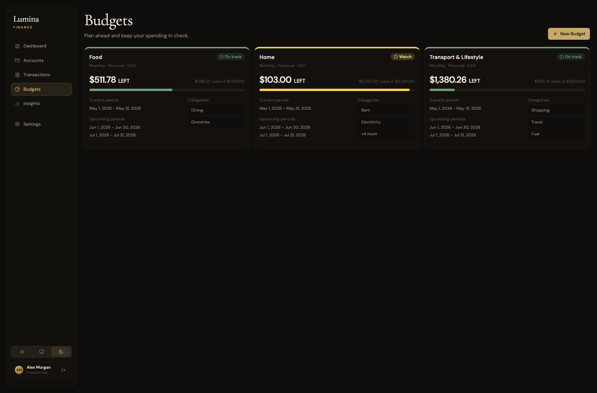

  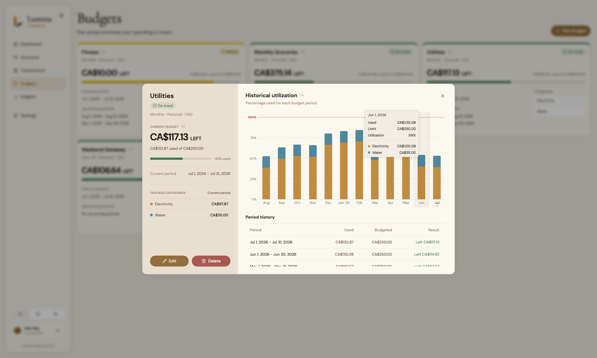
  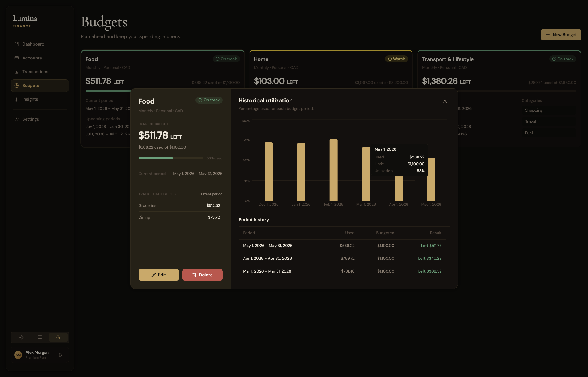

<!-- markdownlint-enable MD033 -->

## Deployment

### Docker

If you'd like to deploy this with Docker, an example docker compose file is provided in [`docker/compose.example.yml`](docker/compose.example.yml) with an example [`.env`](docker/.env.example) file containing the required variables and optional `APP_URL` value.

### Bare Metal

If you'd like to deploy this bare metal, please clone the repo. The frontend is built with vite and you can build it and serve the static files with things like Caddy or Nginx. The backend is built with FastAPI, so you can serve it as a plain ASGI application with uvicorn. All environment variables should be set at the repo's root level. **Note that you will be responsible for generating the required RSA256 private keys as the auto generation currently only works with the Docker deployment as part of the startup process, in additon to configuring the environment variables correctly.**

## Environment Variables

| Variable | Required | Expected Values | Default Value | Purpose |
| --- | --- | --- | --- | --- |
| `APP_URL` | No | URL origin | None | Public frontend origin. Automatically included in the backend CORS allowed origins. If unset, CORS allows all origins. |
| `DB_HOST` | Yes | Hostname or IP | None | PostgreSQL host. |
| `DB_PORT` | Yes | Port number | None | PostgreSQL port. |
| `DB_NAME` | Yes | Database name | None | PostgreSQL database name. |
| `DB_USER` | Yes | Database user | None | PostgreSQL username. |
| `DB_PASSWORD` | Yes | Database password | None | PostgreSQL password. |

### [JWKS (JSON Web Key Set)](https://auth0.com/docs/secure/tokens/json-web-tokens/json-web-key-sets) and JWT Configs

These are some advanced variables that you could also set. Lumina Finance provides an endpoint that exposes known RSA public keys used to verify the JWT tokens. However, you should only modify these settings if you set up an API gateway or a reverse proxy that validates JWT token signatures. If you'd like to verify the JWT tokens so that only validated requests go through your API gateway/reverse proxy, you can configure the options below:

| Variable | Required | Expected Values | Default Value | Purpose |
| --- | --- | --- | --- | --- |
| `JWT_ACCESS_KID` | No | String | `access-kid` | Key ID written into access-token JWT headers and published in JWKS. It does not need to match the private key filename. |
| `JWT_REFRESH_KID` | No | String | `refresh-kid` | Key ID written into refresh-token JWT headers and published in JWKS. It does not need to match the private key filename. |
| `JWT_ACCESS_TOKEN_EXPIRE_SECONDS` | No | Positive integer | `900` | Access-token lifetime in seconds. |
| `JWT_REFRESH_TOKEN_EXPIRE_SECONDS` | No | Positive integer | `86400` | Refresh-token lifetime in seconds. |
| `JWT_ISSUER` | No | String | `lumina-finance` | JWT issuer claim. |
| `JWT_ACCESS_PRIVATE_KEY_PATH` | No | File path | `/data/keys/access_private.pem` | Access token RSA256 private key path inside the container. If a key is not provided, the app will generate one automatically. |
| `JWT_REFRESH_PRIVATE_KEY_PATH` | No | File path | `/data/keys/refresh_private.pem` | Refresh token RSA256 private key path inside the container. If a key is not provided, the app will generate one automatically |

## Roadmap

This roadmap may change as Lumina Finance evolves based on user feedback, technical constraints, and project priorities.

### Near Term

- [ ] Bug and stability improvements
- [ ] UI/UX improvements
- [ ] Report & Analysis tab
- [ ] SaaS development and testing

### Long Term

- [ ] Support SimpleFin and Plaid connections
- [ ] Basic investment tracker (BYOD, or Bring Your Own Data)
- [ ] A few quite ambitious features we're not quite ready to spoil yet :)

## FAQs

1. **Why are you building Lumina Finance when other personal finance tools already exist?**

    There are already great personal finance tools out there, including some that are self-hostable, but many feel outdated, too simplistic, overly complicated, or too focused on one specific workflow.

    We are building Lumina Finance because we want a modern, feature-rich, and accessible alterantive that helps people understand their finances more clearly without needing to fight the software. Our goal is to combine strong financial tracking, a clean and modern user experience, privacy conscious design, and practical insights in one product. Essentially, we want to bulid something that "just works."

2. **Is this open source, and will self-hosting be free?**

    We are committed to keeping Lumina Finance free to self-host for non-commercial personal use, excluding features and services that require external data, paid APIs, or external compute.

    Our goal is to eventually make Lumina Finance open source, but because we may commercialize the project in the future, we are still evaluating the best licensing structure with legal professionals. We want to choose a license that supports community use while keeping the project sustainable.

    For now, any commercial, organizational, or business related use is not permitted unless explicitly authorized. This includes, but is not limited to, self hosting Lumina Finance for employees, clients, customers, contractors, teams, or business operations.

3. **What data does Lumina Finance collect?**

    For self hosted instances, Lumina Finance collects no data. Your data stays within your own deployment environment and never leaves your site. You are also responsible for securing your own deployment, database, backups, and any connected services.
