<!-- markdownlint-disable MD033 -->
<!-- markdownlint-disable MD041 -->
<div align="center">
  
  <h1>Lumina Finance</h1>
</div>

<p align="center">
  <a href="https://github.com/Lumina-Finance/lumina-finance/actions/workflows/pr.yml"></a>&nbsp;&nbsp;
  <a href="https://github.com/Lumina-Finance/lumina-finance/actions/workflows/release.yml"></a>&nbsp;&nbsp;
  <a href="https://hub.docker.com/r/luminahq/lumina-finance"></a>&nbsp;&nbsp;
  <a href="https://github.com/Lumina-Finance/lumina-finance"></a>&nbsp;&nbsp;
  <a href="https://www.buymeacoffee.com/lumina.finance"></a>
</p>

<!-- markdownlint-enable MD033 -->

Lumina Finance is a self-hosted personal finance app for managing your finances, tracking expenses, setting budgets, and analyzing your spending behaviour.

<!-- markdownlint-disable MD033 -->
<picture>
  <source media="(prefers-color-scheme: dark)" srcset="docs/screenshots/hero_dark.png">
  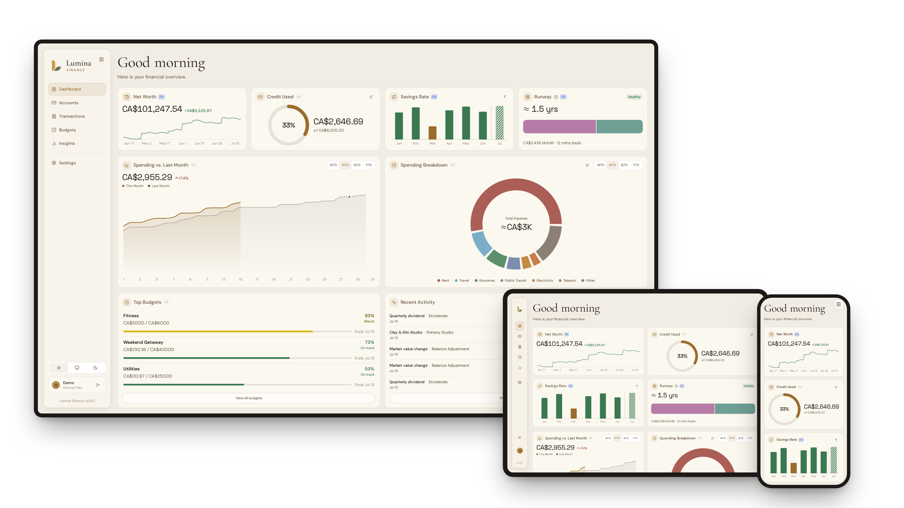
</picture>
<!-- markdownlint-enable MD033 -->

## DISCLAIMER

THIS APPLICATION IS PROVIDED “AS IS” AND “AS AVAILABLE,” WITHOUT WARRANTIES OF ANY KIND. THIS APPLICATION IS A SOFTWARE TOOL ONLY AND DOES NOT PROVIDE FINANCIAL, INVESTMENT, TAX, LEGAL, ACCOUNTING, OR OTHER PROFESSIONAL ADVICE. ANY CALCULATIONS, ESTIMATES, PROJECTIONS, SUMMARIES, OR OTHER OUTPUTS MAY BE INACCURATE OR INCOMPLETE AND SHOULD NOT BE RELIED ON AS A SUBSTITUTE FOR PROFESSIONAL JUDGMENT. YOU ARE SOLELY RESPONSIBLE FOR REVIEWING ALL OUTPUTS AND FOR ANY DECISIONS YOU MAKE. USE OF THIS APPLICATION IS AT YOUR OWN RISK.

## Demo

<!-- markdownlint-disable MD033 -->

https://github.com/user-attachments/assets/84eda1e4-1b73-422b-be86-0b662add0949

<!-- markdownlint-enable MD033 -->

## Features

Lumina Finance gives you one place to track accounts, transactions, budgets, and financial trends while keeping the app under your control.

- **Accounts** - Track cash, credit, savings, and other account types with balance history, detail views, and hide archived accounts
- **Multi-currency** - Track accounts and activity in different currencies with FX conversions across dashboards, budgets, runway, and insights
- **Transactions** - Add transactions, then organise them with merchants, categories, tags, and notes
- **Imports** - Upload CSV transaction files exported from any app, map columns to accounts and categories, preview rows, and create missing accounts or categories during import, or use the dedicated Firefly III importer to migrate transactions, accounts, categories, and budgets, with more app importers coming
- **Budgets** - Create recurring or one-off budgets, attach them to categories, see current and historical utilization at a glance, and archive budgets you no longer use while keeping their history
- **Dashboard** - Check net worth, credit usage, spending, savings rate, recent activity, and top budgets from one place
- **Runway** - Choose the accounts that make up your cash cushion and see how many months they could cover based on your recent average spending in the worst case scenario
- **Insights** - Review cash flow, income and expense breakdowns, net worth trends, savings-rate trends, and merchant patterns
- **Account security** - Protect sign-in with two-factor authentication using an authenticator app or passkeys, fall back on recovery codes, and reset a forgotten password by email
- **Single sign-on** - Sign in through your own OpenID Connect provider, or link one to an existing account and manage it from settings
- **Self-hostable** - You have full control of your data, run it locally with Docker

### Roadmap

This roadmap may change as Lumina Finance evolves based on user feedback, technical constraints, and project priorities.

<!-- markdownlint-disable MD033 -->
<details>
<summary><b>Shipped</b></summary>

- [X] Insights tab for deeper reports and trends
- [X] Multi-currency support
- [X] Row-level security for per-user data isolation
- [X] Application security improvements and fixes
- [X] OIDC and WebAuthN support

</details>
<!-- markdownlint-enable MD033 -->

#### Near Term

In no particular order:

- [ ] SimpleFIN support
- [ ] Docs site
- [ ] Internationalization and multi-language support ([#92](https://github.com/Lumina-Finance/lumina-finance/discussions/92), [#77](https://github.com/Lumina-Finance/lumina-finance/discussions/77))
- [ ] Goals ([#75](https://github.com/Lumina-Finance/lumina-finance/discussions/75))
- [ ] Plaid support
- [ ] SaaS development and testing
- [ ] Extend bank sync to other regions (**all TBD**, e.g. Akahu for New Zealand, Basiq for Australia, Open Banking for Europe). We aim to support as many regions as possible in addition to North America, so if you have any suggestions, please feel free to submit a feature request!

#### Long Term

- [ ] Basic investment tracker (bring your own data)
- [ ] Native iOS and macOS app
- [ ] A few quite ambitious features we're not quite ready to spoil yet :)

## Screenshots

Every page is fully optimized for desktop, tablet, and mobile.

<!-- markdownlint-disable MD033 -->

<p align="center">
  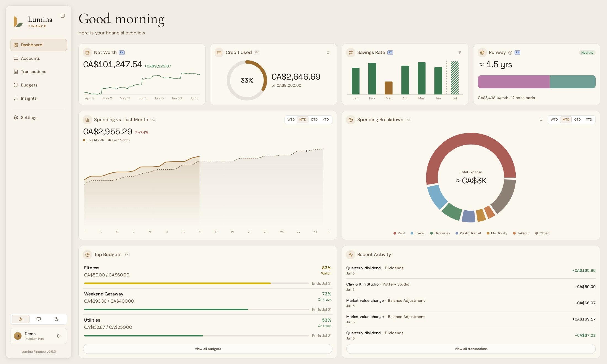
  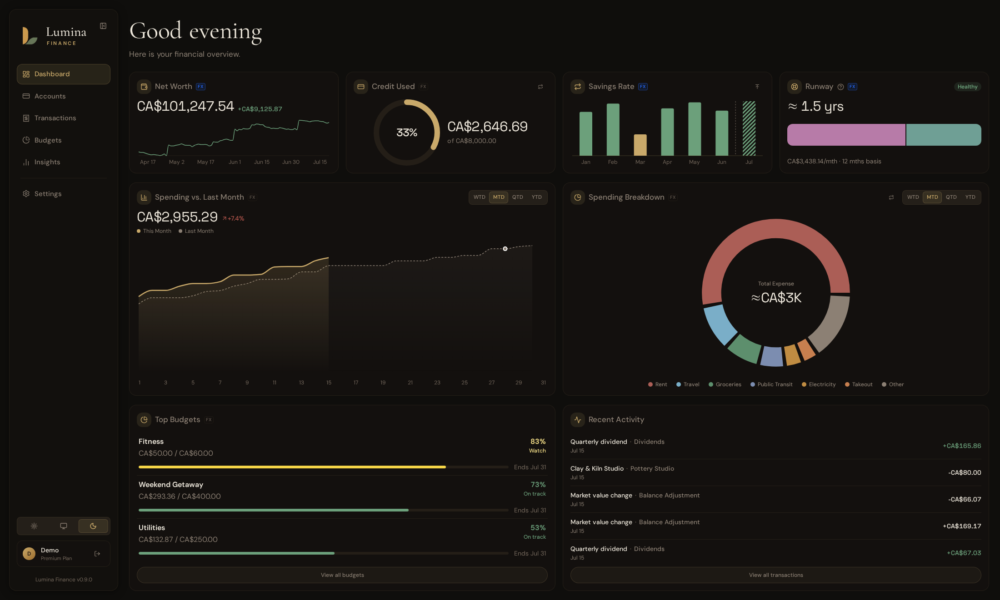
</p>

<p align="center">
  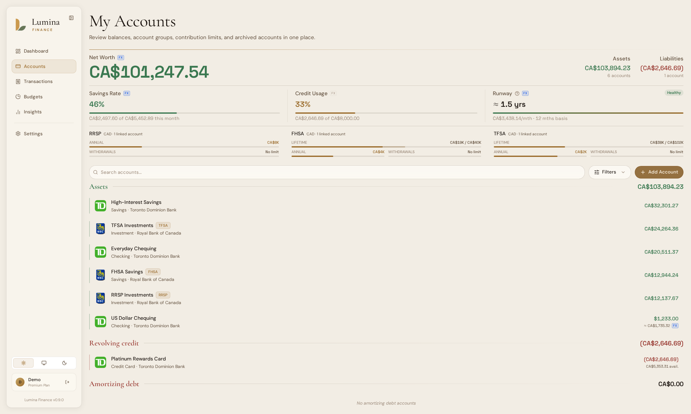
  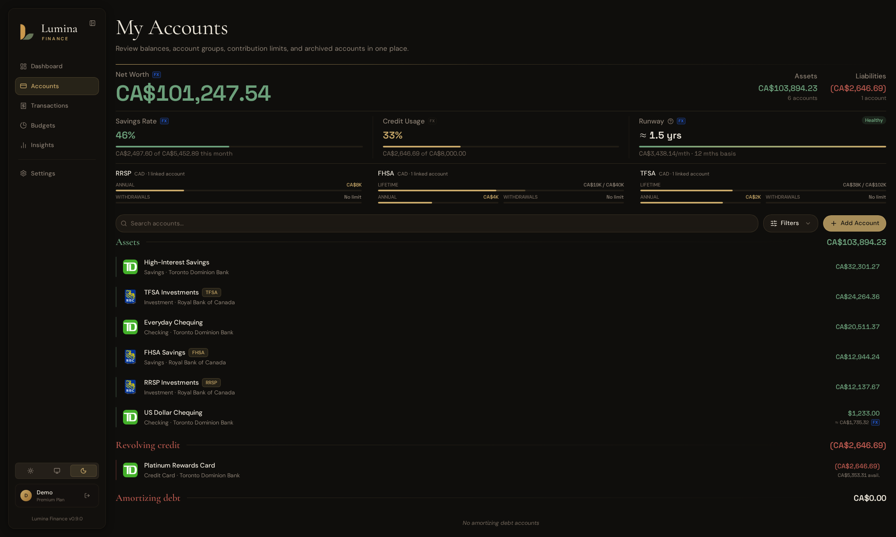
</p>

<p align="center">
  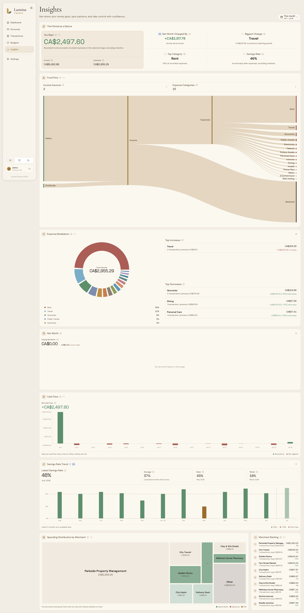
  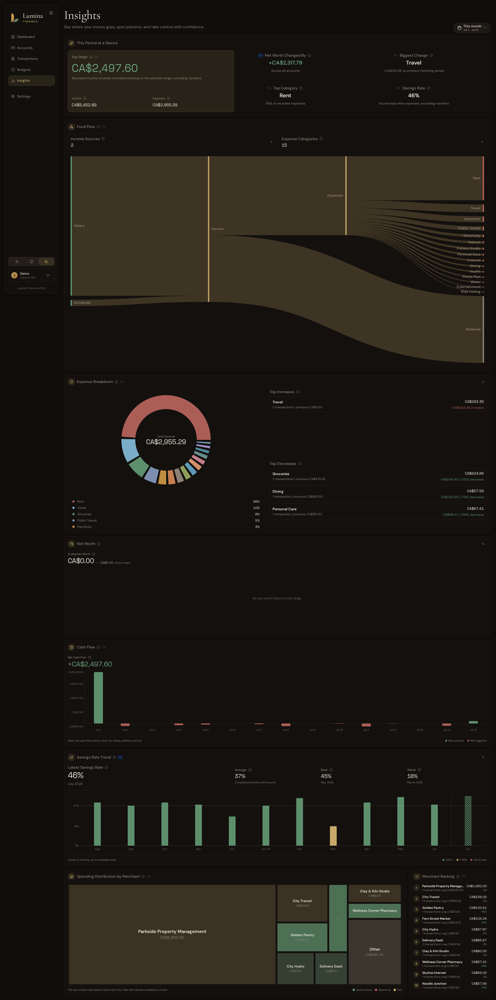
</p>

<details>
<summary>More screenshots</summary>

<p align="center">
  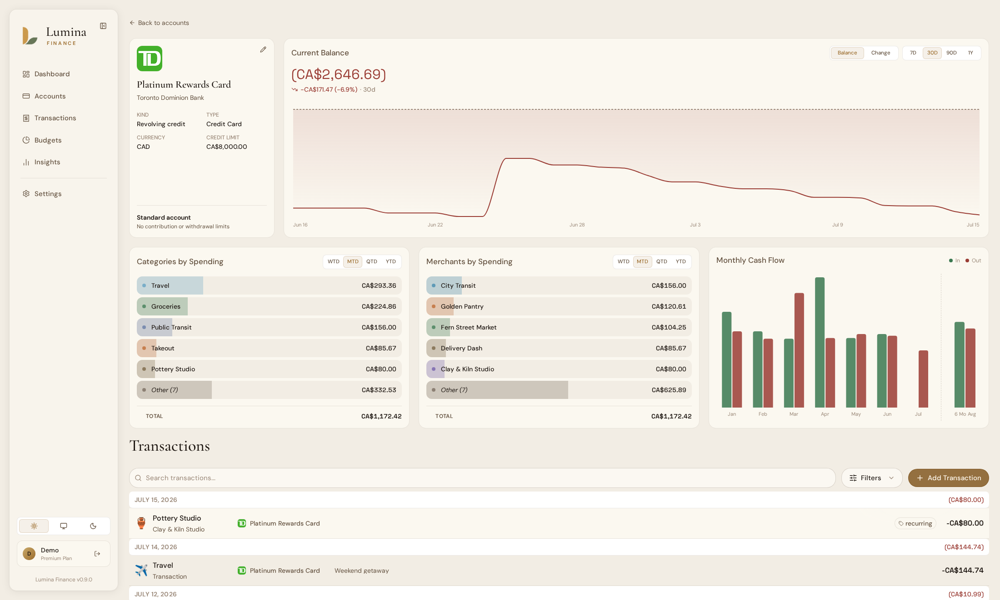
  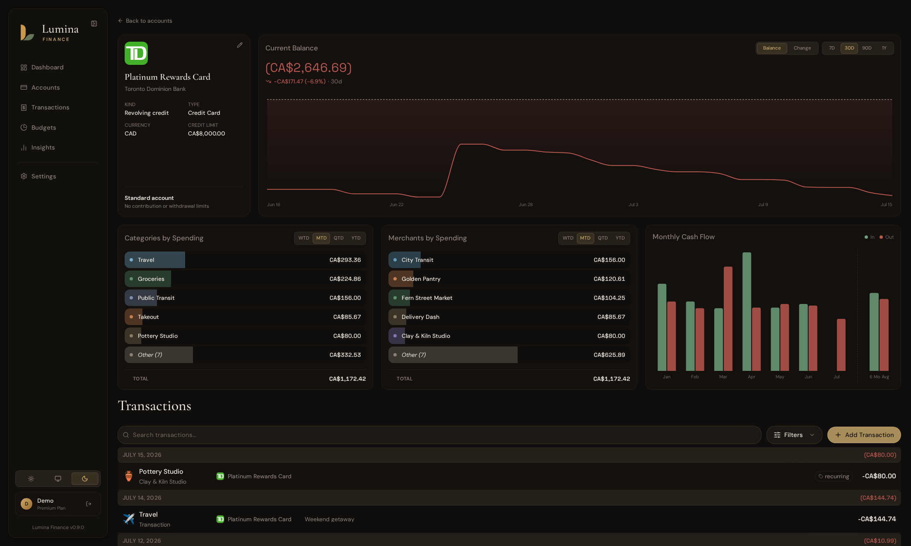
</p>

<p align="center">
  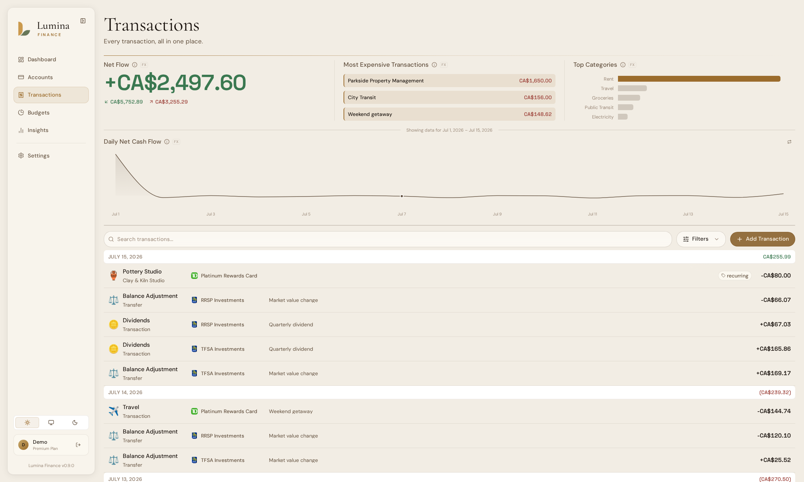
  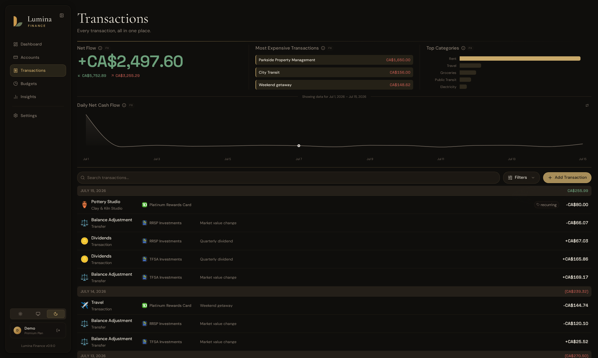
</p>

<p align="center">
  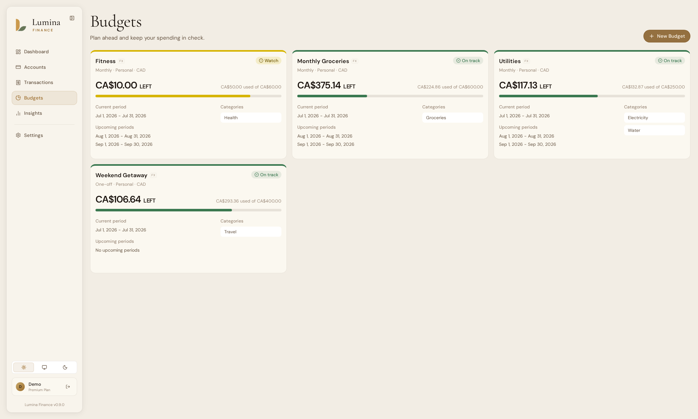
  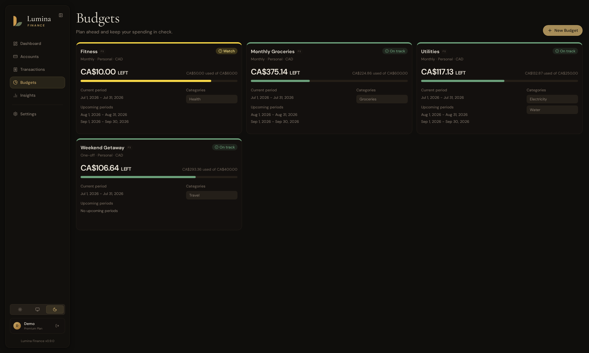
</p>

<p align="center">
  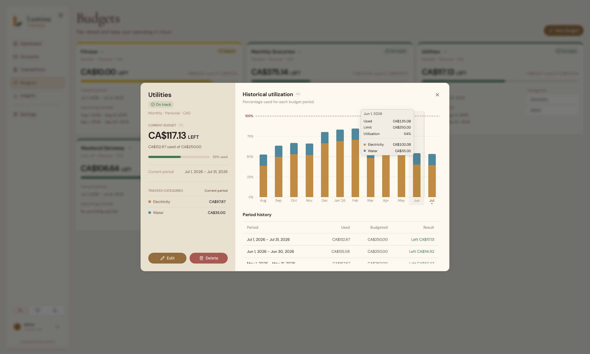
  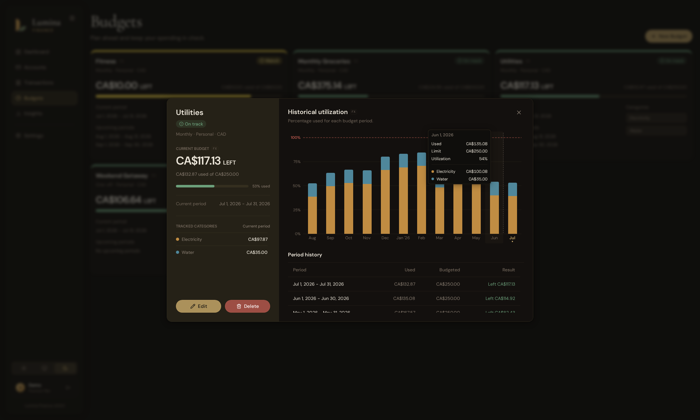
</p>

<p align="center">
  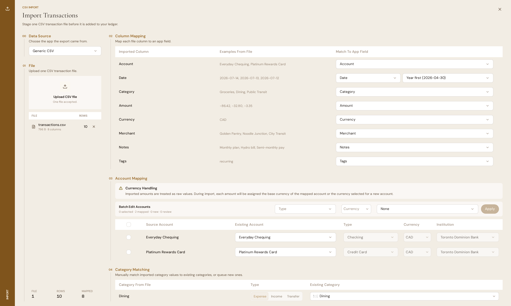
  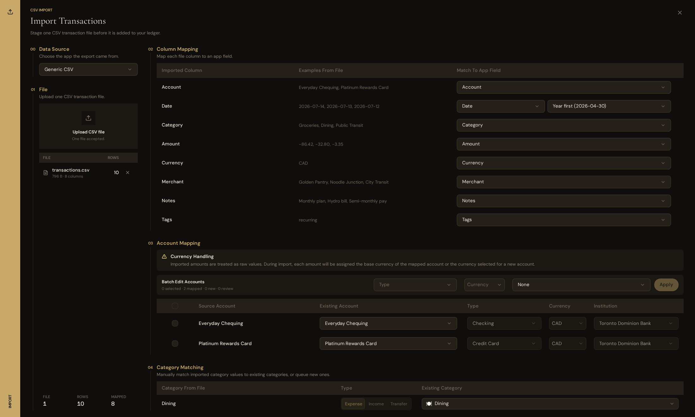
</p>

</details>

<!-- markdownlint-enable MD033 -->

## Deployment

### Docker

If you'd like to deploy this with Docker, an example docker compose file is provided in [`docker/compose.yml`](docker/compose.yml) with an example [`.env`](docker/.env.example) file containing the required database variables and the most common optional settings, including email delivery and single sign-on. The compose file passes `.env` through to the app, so any variable from the [Environment Variables](#environment-variables) tables below can be set there.

To get a fresh instance running:

```sh
cd docker
cp .env.example .env
docker compose up -d
```

Before starting the stack, set `DB_PASSWORD` in `.env` to a password of your own. The example file prefills the other database values for the bundled PostgreSQL service. Once the containers are up, the app is available at `http://localhost:8080`. If the instance is reachable from other machines, also set `APP_URL` to the origin you use to access it.

### Frankfurter (Foreign Currency Exchange Rates)

Lumina uses [Frankfurter](https://github.com/lineofflight/frankfurter) for FX rates. By default, it uses the hosted API at `https://api.frankfurter.dev/v2`.

Frankfurter can also be self-hosted. To use a self-hosted instance, see Frankfurter's GitHub repository for details. After it's set up, set `FRANKFURTER_URL` to its versioned API URL, including the `/v2` path, for Lumina Finance to use your self-hosted instance.

## Environment Variables

| Variable | Required | Expected Values | Default Value | Purpose |
| --- | --- | --- | --- | --- |
| `APP_URL` | No | URL origin | None | Public frontend origin. Automatically included in the backend CORS allowed origins. If unset, CORS allows all origins |
| `APP_IMAGE_TAG` | No | Release tag | `latest` | Docker image tag the example compose file runs. Pin a specific release to control exactly when updates happen |
| `DB_HOST` | Yes | Hostname or IP | None | PostgreSQL host |
| `DB_PORT` | Yes | Port number | None | PostgreSQL port |
| `DB_NAME` | Yes | Database name | None | PostgreSQL database name |
| `DB_USER` | Yes | Database user | None | PostgreSQL admin role used on startup to provision the `lumina_migrator` and `lumina_app` roles |
| `DB_PASSWORD` | Yes | Database password | None | Password for the PostgreSQL admin role |
| `MIGRATOR_DB_PASSWORD` | No | Database password | Auto-generated | Password for the `lumina_migrator` role that owns the schema and runs migrations. If unset, a password is generated on first start and persisted to `/data/secrets/migrator_db_password` on the data volume, then reused on later starts |
| `APP_DB_PASSWORD` | No | Database password | Auto-generated | Password for the `lumina_app` role that serves requests under row-level security. If unset, a password is generated on first start and persisted to `/data/secrets/app_db_password` on the data volume, then reused on later starts |
| `FRANKFURTER_URL` | No | URL including API version path | `https://api.frankfurter.dev/v2` | Frankfurter-compatible FX rate API URL; set this to a self-hosted Frankfurter instance to keep FX lookups private |
| `UPDATE_CHECKS_ENABLED` | No | `true` or `false` | `true` in official Docker images | Enables update checks against GitHub releases and matching Docker image tags |

### Email

Lumina Finance sends email for password resets. The default `logging` backend prints outgoing mail to the container logs instead of sending it, so the app runs fine before SMTP is configured.

| Variable | Required | Expected Values | Default Value | Purpose |
|-|-|-|-|-|
| `EMAIL_BACKEND` | No | `smtp` or `logging` | `logging` | `smtp` delivers mail through the server below, `logging` prints it to the container logs |
| `SMTP_HOST` | Only if `EMAIL_BACKEND=smtp` | Hostname | None | SMTP server host |
| `SMTP_PORT` | No | Port number | `587` | SMTP server port |
| `SMTP_USERNAME` | Only if `EMAIL_BACKEND=smtp` | String | None | SMTP auth username |
| `SMTP_PASSWORD` | Only if `EMAIL_BACKEND=smtp` | String | None | SMTP auth password |
| `SMTP_USE_TLS` | No | `true` or `false` | `true` | Use STARTTLS when connecting to the SMTP server |
| `MAIL_FROM` | No | Email address | Value of `SMTP_USERNAME` | From address on outgoing mail |

### Password Reset

| Variable | Required | Expected Values | Default Value | Purpose |
|-|-|-|-|-|
| `PASSWORD_RESET_TOKEN_EXPIRE_SECONDS` | No | Positive integer | `900` | How long a password reset link stays valid after it is emailed |
| `PASSWORD_RESET_DAILY_EMAIL_LIMIT` | No | Positive integer | `3` | Cap on password reset emails per account per rolling day |

### Passkeys and Two-Factor Authentication

Two-factor authentication with an authenticator app works without any of these settings. Passkeys are bound to a specific domain, called the relying party ID, which defaults to the hostname in `APP_URL`. A bare IP address cannot be a relying party ID, so passkeys need a real domain name to work at all.

| Variable | Required | Expected Values | Default Value | Purpose |
|-|-|-|-|-|
| `WEBAUTHN_RP_ID` | No | Domain name | Hostname of `APP_URL` | The domain passkeys are bound to. Only set this if it needs to differ from the app's own domain |
| `WEBAUTHN_ORIGINS` | No | Comma-separated list of URL origins | Value of `APP_URL` | Origins a passkey sign-in is accepted from |
| `WEBAUTHN_CHALLENGE_EXPIRE_SECONDS` | No | Positive integer | `300` | How long a passkey prompt stays valid before it needs to be retried |
| `TWO_FACTOR_STAGING_EXPIRE_SECONDS` | No | Positive integer | `1800` | How long a newly set up but not yet confirmed second factor and its recovery codes are kept before being discarded |
| `MFA_CHALLENGE_TOKEN_EXPIRE_SECONDS` | No | Positive integer | `120` | How long a sign-in has to complete its second factor after the password step |

### Single Sign-On (OIDC)

Lumina Finance can accept sign-ins from any standards-compliant OpenID Connect provider, such as Authentik or Authelia. Single sign-on is off by default and turns on when `OIDC_GENERIC_CLIENT_ID` is set, and a half-configured provider fails at startup. `APP_URL` must be set, since the provider redirects back to `<APP_URL>/auth/oidc/callback`.

| Variable | Required | Expected Values | Default Value | Purpose |
|-|-|-|-|-|
| `OIDC_GENERIC_CLIENT_ID` | To enable single sign-on | String | None | OAuth client ID registered with the provider. Setting it turns single sign-on on |
| `OIDC_GENERIC_ISSUER` | With the client ID | Issuer URL | None | Issuer exactly as the provider publishes it, including any trailing slash |
| `OIDC_GENERIC_CLIENT_SECRET` | With the client ID | String | None | OAuth client secret, encrypted at rest with `APP_ENCRYPTION_KEY` |
| `OIDC_GENERIC_DISPLAY_NAME` | No | String | `OIDC` | Sign-in button label. When it matches a self-hosted app, such as `Authentik`, that app's logo replaces the generic icon on the button |
| `OIDC_GENERIC_SCOPES` | No | Space-separated scopes | `openid email profile` | Scopes requested from the provider. Must include `openid` |
| `OIDC_REQUIRE_VERIFIED_EMAIL` | No | `true` or `false` | `true` | Whether a first-time sign-in must have a provider-verified email to create an account. Set `false` for providers that do not truly verify email, such as Authentik and Authelia. Existing accounts are never auto-linked by email regardless |
| `OIDC_AUTHORIZATION_REQUEST_EXPIRE_SECONDS` | No | Positive integer | `600` | How long a pending sign-in has to complete at the provider and return before it expires |
| `OIDC_ONBOARDING_TOKEN_EXPIRE_SECONDS` | No | Positive integer | `600` | How long a first-time sign-in has to finish the profile completion step |
| `OIDC_REAUTH_STEPUP_TOKEN_EXPIRE_SECONDS` | No | Positive integer | `300` | How long a passwordless account has to set a password or manage its providers after re-confirming with the provider |

### Encryption at Rest

| Variable | Required | Expected Values | Default Value | Purpose |
|-|-|-|-|-|
| `APP_ENCRYPTION_KEY` | No | Fernet key | Auto-generated | Encrypts secrets stored in the database, such as two-factor secrets and the OIDC client secret. If unset, a key is generated on first start and persisted to `/data/secrets/app_encryption_key` on the data volume. Setting a value that differs from an already persisted key stops the container at startup, since the stored secrets could no longer be decrypted. Losing this key makes the stored secrets undecryptable, so back up the data volume alongside your database |

### [JWKS (JSON Web Key Set)](https://auth0.com/docs/secure/tokens/json-web-tokens/json-web-key-sets) and JWT Configs

These are some advanced variables that you could also set. Lumina Finance provides an endpoint that exposes known RSA public keys used to verify the JWT tokens. However, you should only modify these settings if you set up an API gateway or a reverse proxy that validates JWT token signatures. If you'd like to verify the JWT tokens so that only validated requests go through your API gateway/reverse proxy, you can configure the options below:

| Variable | Required | Expected Values | Default Value | Purpose |
| --- | --- | --- | --- | --- |
| `JWT_ACCESS_KID` | No | String | `access-kid` | Key ID written into access-token JWT headers and published in JWKS. It does not need to match the private key filename |
| `JWT_REFRESH_KID` | No | String | `refresh-kid` | Key ID written into refresh-token JWT headers and published in JWKS. It does not need to match the private key filename |
| `JWT_ACCESS_TOKEN_EXPIRE_SECONDS` | No | Positive integer | `900` | Access-token lifetime in seconds |
| `JWT_REFRESH_TOKEN_EXPIRE_SECONDS` | No | Positive integer | `86400` | Refresh-token lifetime in seconds |
| `JWT_ISSUER` | No | String | `lumina-finance` | JWT issuer claim |
| `JWT_ACCESS_PRIVATE_KEY_PATH` | No | File path | `/data/keys/access_private.pem` | Access token RSA256 private key path inside the container. If a key is not provided, the app will generate one automatically |
| `JWT_REFRESH_PRIVATE_KEY_PATH` | No | File path | `/data/keys/refresh_private.pem` | Refresh token RSA256 private key path inside the container. If a key is not provided, the app will generate one automatically |

## FAQs

1. **Why are you building Lumina Finance when other personal finance tools already exist?**

    There are already great personal finance tools out there, including some that are self-hostable, but many feel outdated, too simplistic, overly complicated, or too focused on one specific workflow.

    We are building Lumina Finance because we want a modern, feature-rich, and accessible alternative that helps people understand their finances more clearly without needing to fight the software. Our goal is to combine strong financial tracking, a clean and modern user experience, privacy conscious design, and practical insights in one product. Essentially, we want to build something that "just works."

2. **Is this open source, and will self-hosting be free?**

    We are committed to keeping Lumina Finance free to self-host for non-commercial personal use, excluding features and services that require external data, paid APIs, or external compute.

    Our goal is to eventually make Lumina Finance open source, but because we may commercialize the project in the future, we are still evaluating the best licensing structure with legal professionals. We want to choose a license that supports community use while keeping the project sustainable.

    For now, any commercial, organizational, or business related use is not permitted unless explicitly authorized. This includes, but is not limited to, self-hosting Lumina Finance for employees, clients, customers, contractors, teams, or business operations.

3. **What data does Lumina Finance collect?**

    For self-hosted instances, Lumina Finance collects no data. Your data stays within your own deployment environment and never leaves your site. You are also responsible for securing your own deployment, database, backups, and any connected services.

---

<!-- markdownlint-disable MD033 -->
<div align="center">
  <a href="https://www.star-history.com/?repos=Lumina-Finance%2Flumina-finance&type=date&legend=top-left">
    <picture>
      <source media="(prefers-color-scheme: dark)" srcset="https://api.star-history.com/chart?repos=Lumina-Finance/lumina-finance&type=date&theme=dark&legend=top-left&sealed_token=G8nGy5XJj7OX0x2gmytcpCaPGZQzG3mN10PijRfiU3ck66mFy916ZMC2lk6RQzPTVuxuLKDb5ludxBinqLypUB_C9dtNwIbulbsIOlnn8SU0iySjcHLZrA" />
      <source media="(prefers-color-scheme: light)" srcset="https://api.star-history.com/chart?repos=Lumina-Finance/lumina-finance&type=date&legend=top-left&sealed_token=G8nGy5XJj7OX0x2gmytcpCaPGZQzG3mN10PijRfiU3ck66mFy916ZMC2lk6RQzPTVuxuLKDb5ludxBinqLypUB_C9dtNwIbulbsIOlnn8SU0iySjcHLZrA" />
      
    </picture>
  </a>
</div>
