<!-- markdownlint-disable MD033 -->
<!-- markdownlint-disable MD041 -->
<div align="center">
  
  <h1>Lumina Finance</h1>
</div>

<p align="center">
  <a href="https://docs.luminafinance.co"></a>&nbsp;&nbsp;
  <a href="https://www.reddit.com/r/LuminaFinance/"></a>&nbsp;&nbsp;
  <a href="https://hub.docker.com/r/luminahq/lumina-finance"></a>&nbsp;&nbsp;
  <a href="https://github.com/Lumina-Finance/lumina-finance"></a>
</p>

<p align="center">
  <a href="https://www.buymeacoffee.com/lumina.finance"></a>
</p>

<!-- markdownlint-enable MD033 -->

Lumina Finance is a self-hosted personal finance app that helps you understand your spending behaviour, track expenses, and set budgets while keeping you in control of your data.

Join the community at [r/LuminaFinance](https://www.reddit.com/r/LuminaFinance/) to ask questions, share feedback and discuss releases.

<!-- markdownlint-disable MD033 -->
<picture>
  <source media="(prefers-color-scheme: dark)" srcset="docs/screenshots/hero_dark.png">
  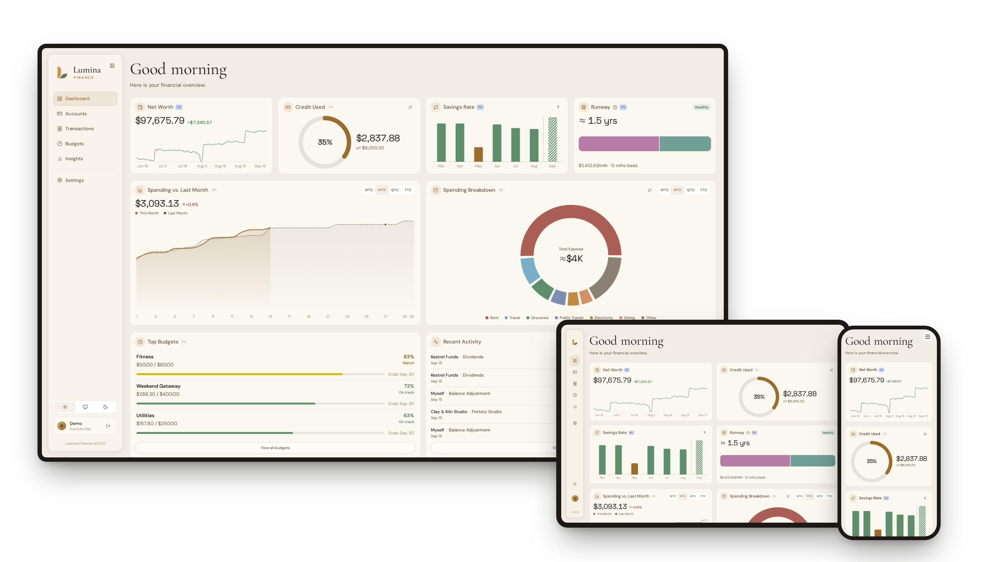
</picture>
<!-- markdownlint-enable MD033 -->

## DISCLAIMER

THIS APPLICATION IS PROVIDED “AS IS” AND “AS AVAILABLE,” WITHOUT WARRANTIES OF ANY KIND. THIS APPLICATION IS A SOFTWARE TOOL ONLY AND DOES NOT PROVIDE FINANCIAL, INVESTMENT, TAX, LEGAL, ACCOUNTING, OR OTHER PROFESSIONAL ADVICE. ANY CALCULATIONS, ESTIMATES, PROJECTIONS, SUMMARIES, OR OTHER OUTPUTS MAY BE INACCURATE OR INCOMPLETE AND SHOULD NOT BE RELIED ON AS A SUBSTITUTE FOR PROFESSIONAL JUDGMENT. YOU ARE SOLELY RESPONSIBLE FOR REVIEWING ALL OUTPUTS AND FOR ANY DECISIONS YOU MAKE. USE OF THIS APPLICATION IS AT YOUR OWN RISK.

## Permitted use

Lumina Finance is made available for personal, non-commercial use only. You may install, run and modify it to manage your own finances, and you may share access with your family and friends free of charge.

Commercial use requires prior written permission. Commercial use includes, without limitation:

- hosting, operating or providing access to Lumina Finance for another person in exchange for any fee or other consideration, whether charged directly or recovered through another product, service, subscription, hosting plan, or setup, support or maintenance package
- using it to provide bookkeeping, accounting, financial planning, advisory or similar services to clients or customers
- offering it as a hosted, managed or software-as-a-service product
- selling, sublicensing or distributing it, or any modified version, for consideration

These terms apply equally to any modified, renamed or derivative version. They cannot be avoided by describing a paying party as a friend, family member or guest, or by structuring payment as a donation, gift, membership or separate charge. All rights not expressly granted here are reserved. To ask about commercial use, start a [discussion](https://github.com/Lumina-Finance/lumina-finance/discussions).

## Demo

<!-- markdownlint-disable MD033 -->

https://github.com/user-attachments/assets/ff25a063-eec5-4069-b019-3e0ebb8c7ed9

<!-- markdownlint-enable MD033 -->

## Features

Lumina Finance gives you one place to track accounts, transactions, budgets, and financial trends while you keep your data under your control.

- **Accounts** - Lumina Finance helps you track cash, credit, savings, and every other account type, with a detailed view and balance history for each. Archived accounts can be hidden when you don't need to see them.
- **Multi-currency** - Exchange rate conversions help you follow accounts and activity in different currencies across dashboards, budgets, runway, and insights.
- **Transactions** - You can add transactions and organize them with merchants, categories, tags, and notes to keep your records clear.
- **Imports** - The CSV importer brings in new transactions from your bank as you go, and app-specific importers help you move your history over from another app.
- **Tax-advantaged accounts** - Accounts with the same tax-advantaged structure can be grouped together, helping you track their contribution and withdrawal limits in one place.
- **Budgets** - Recurring and one-time budgets help you compare your spending against the amounts you set for each category. Their history stays available after you archive them.
- **Dashboard** - The dashboard brings your net worth, credit usage, spending, savings rate, recent activity, and top budgets together in one beautifully presented view.
- **Runway** - The runway view shows you exactly how long your funds will last in the worst-case scenario.
- **Insights** - Cash flow reports, income and expense breakdowns, and merchant patterns help you understand your finances, alongside trends in your net worth and savings rate.
- **Account security** - Two-factor authentication protects your sign-in through an authenticator app or passkeys, with recovery codes as a fallback. Email password resets help you regain access if you forget your password.
- **Single sign-on** - You can sign in through your own OpenID Connect provider, or link it to an existing account and manage it from settings.
- **Self-hostable** - Running Lumina Finance locally with Docker keeps you in full control of your data.

### Importers

Each app-specific importer is tested every week against the app's latest release.

<!-- markdownlint-disable MD033 -->
| Importer | Used for | Status |
|-|-|-|
| CSV | Everyday imports from your bank | |
| Actual Budget | Moving over from Actual Budget | <a href="https://github.com/Lumina-Finance/lumina-finance/actions/workflows/actual-check.yml"></a> |
| Firefly III | Moving over from Firefly III | <a href="https://github.com/Lumina-Finance/lumina-finance/actions/workflows/firefly-check.yml"></a> |
<!-- markdownlint-enable MD033 -->

### Roadmap

This roadmap may change as Lumina Finance evolves based on user feedback, technical constraints, and project priorities.

<!-- markdownlint-disable MD033 -->
<details open>
<summary><b>Shipped</b></summary>

- [X] Insights tab for deeper reports and trends
- [X] Multi-currency support
- [X] Row-level security for per-user data isolation
- [X] Application security improvements and fixes
- [X] OIDC and WebAuthN support

</details>
<!-- markdownlint-enable MD033 -->

#### Near Term

In no particular order:

- [ ] SimpleFIN support (in progress)
- [ ] Docs site (in progress)
  - [X] self-hosting documentation
  - [ ] user guides
- [ ] Internationalization and multi-language support (in progress; [#92](https://github.com/Lumina-Finance/lumina-finance/discussions/92), [#77](https://github.com/Lumina-Finance/lumina-finance/discussions/77))
- [ ] Goals ([#75](https://github.com/Lumina-Finance/lumina-finance/discussions/75))
- [ ] Plaid support
- [ ] SaaS development and testing
- [ ] Extend bank sync to other regions (**all TBD**, e.g. Akahu for New Zealand, Basiq for Australia, Open Banking for Europe). We aim to support as many regions as possible in addition to North America, so if you have any suggestions, please feel free to submit a feature request!

#### Long Term

- [ ] Basic investment tracker (bring your own data)
- [ ] Native iOS and macOS app
- [ ] Android app
- [ ] A few quite ambitious features we are not quite ready to spoil yet :)

## Screenshots

Every page is fully optimized for desktop, tablet, and mobile.

<!-- markdownlint-disable MD033 -->

<p align="center">
  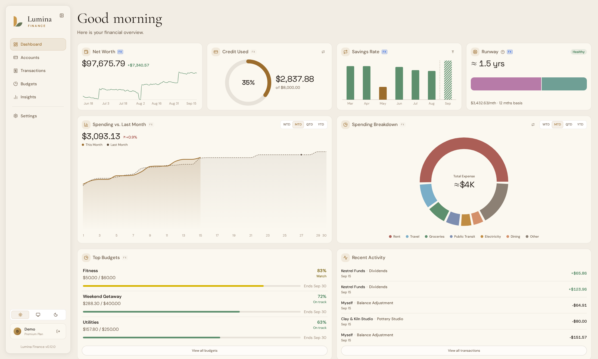
  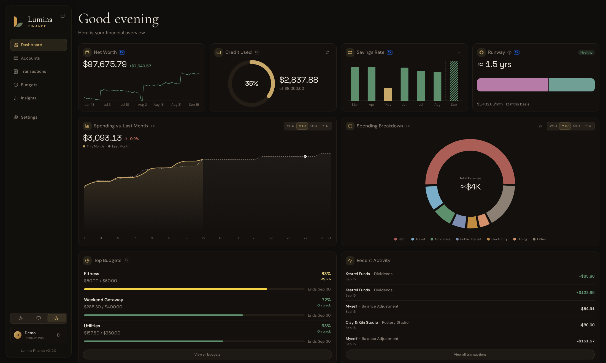
</p>

<p align="center">
  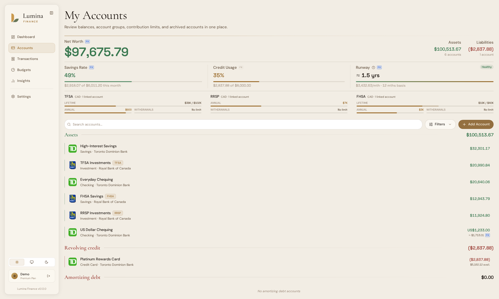
  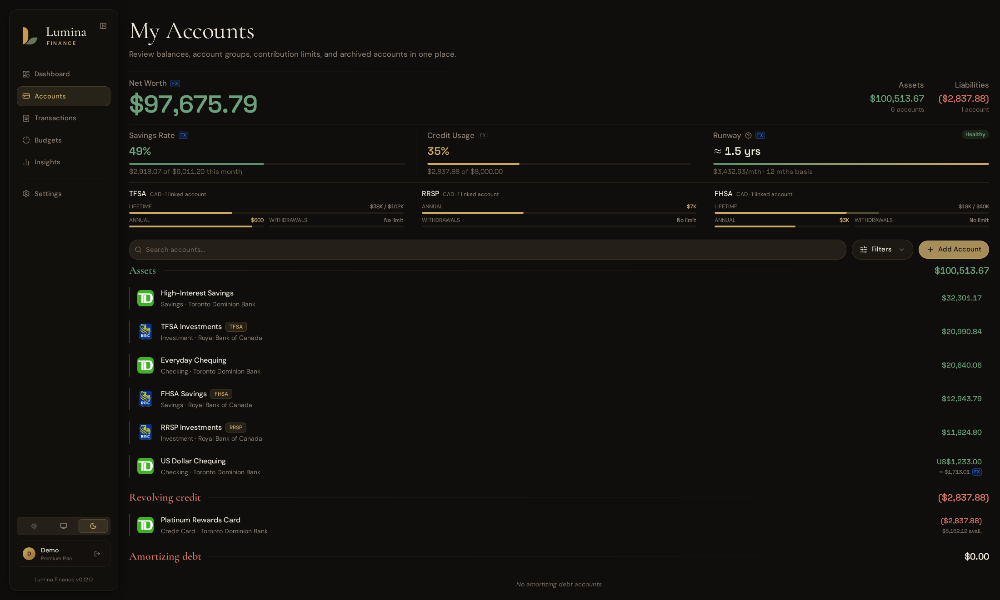
</p>

<p align="center">
  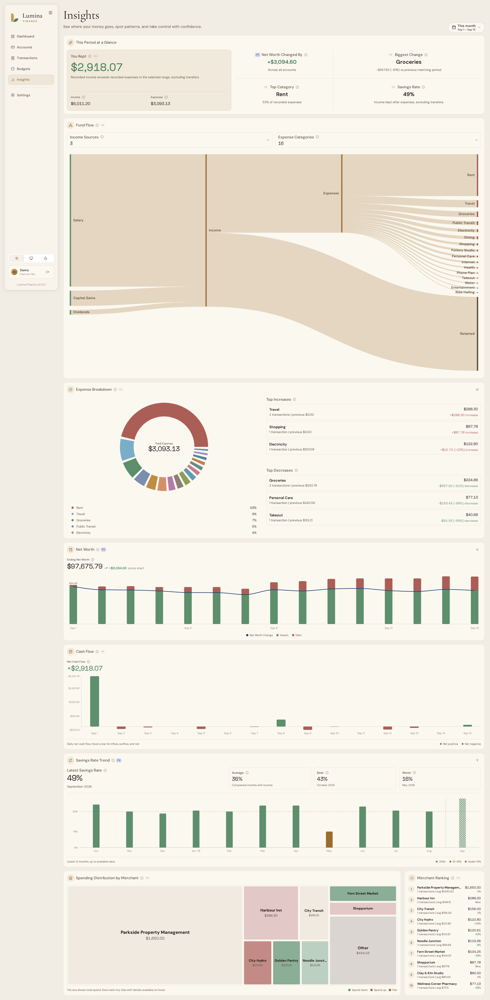
  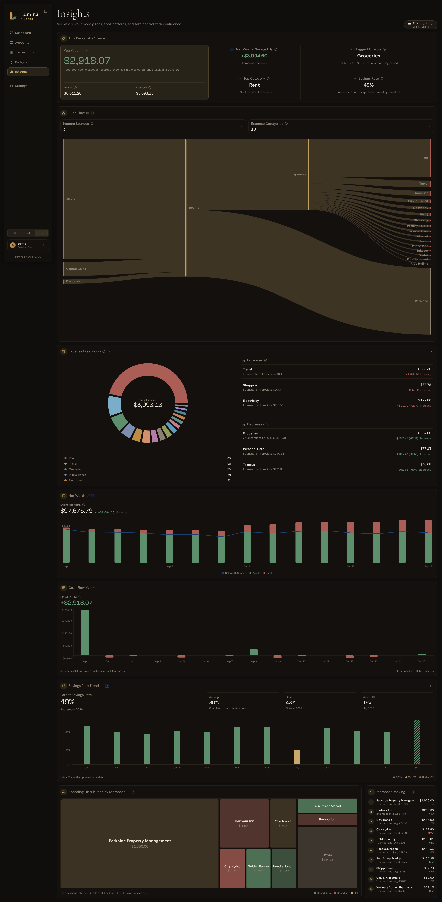
</p>

<details>
<summary>More screenshots</summary>

<p align="center">
  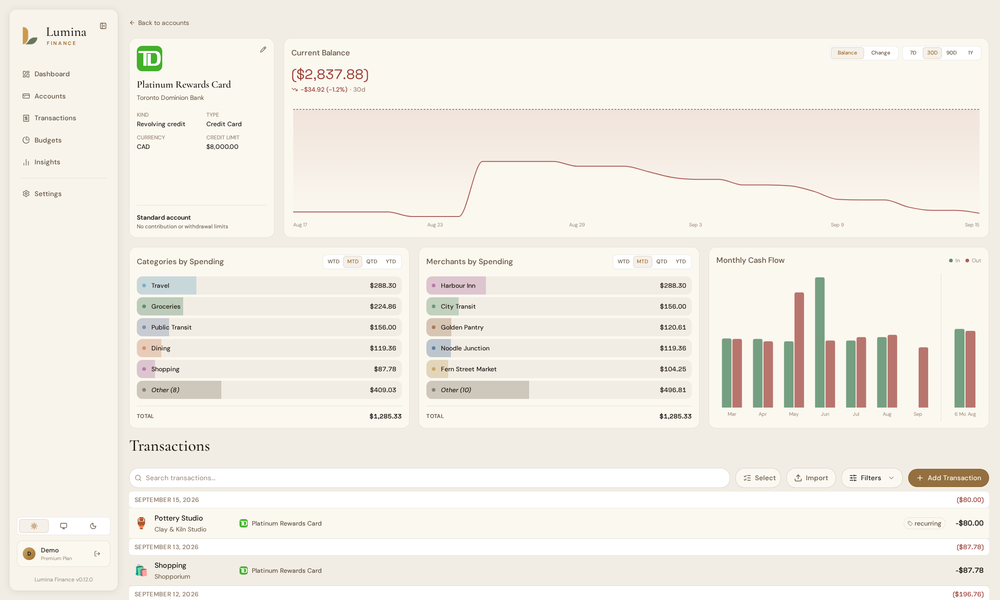
  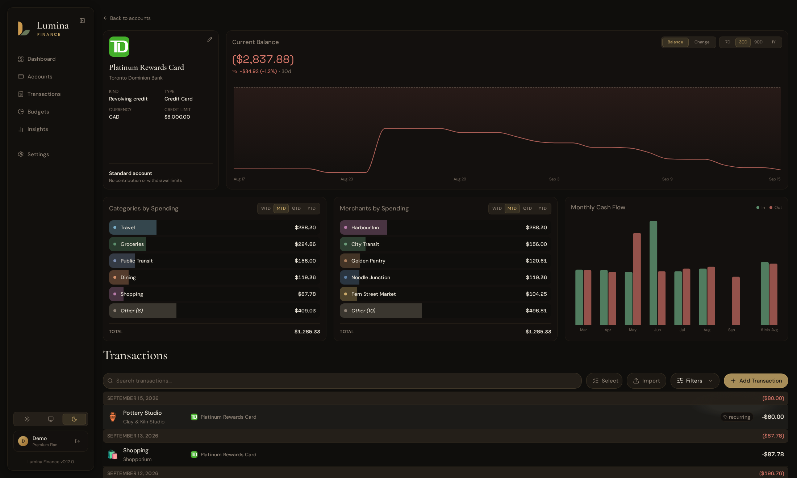
</p>

<p align="center">
  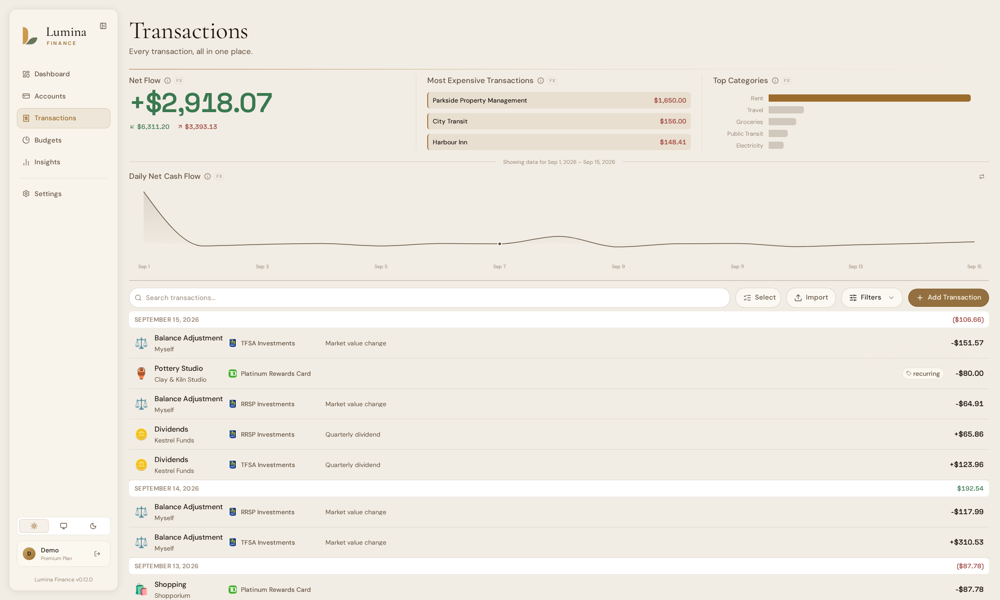
  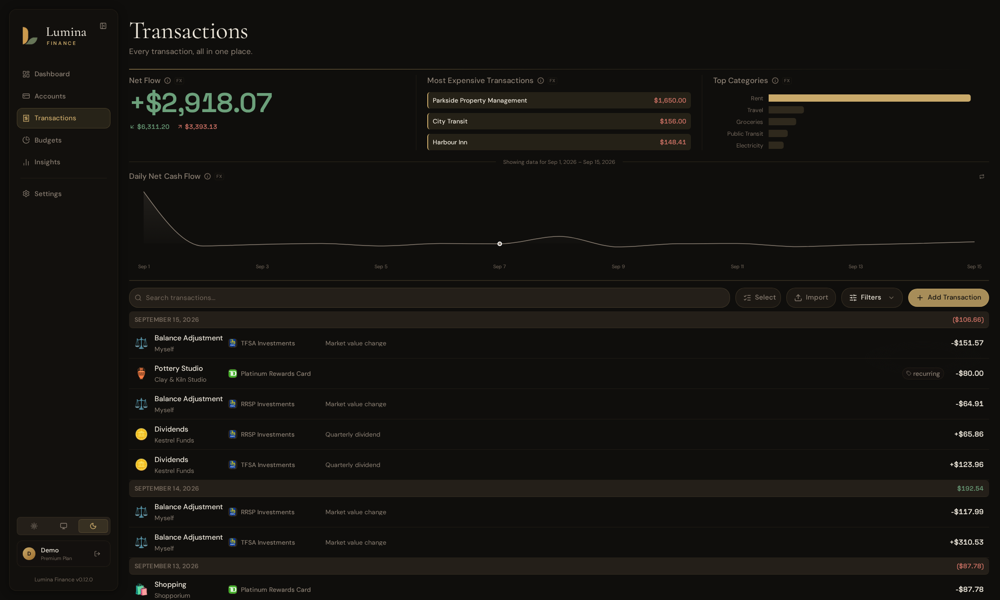
</p>

<p align="center">
  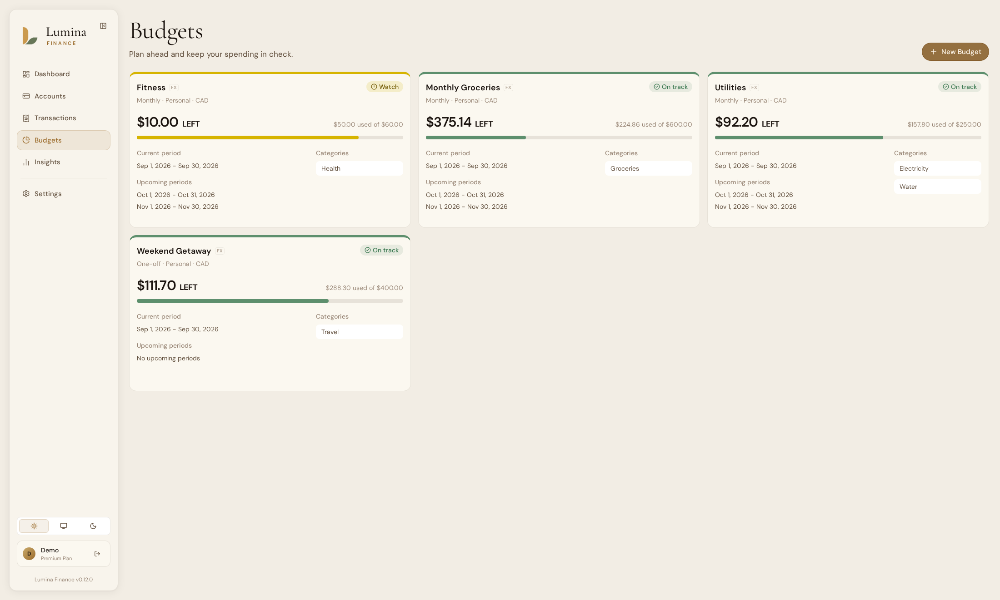
  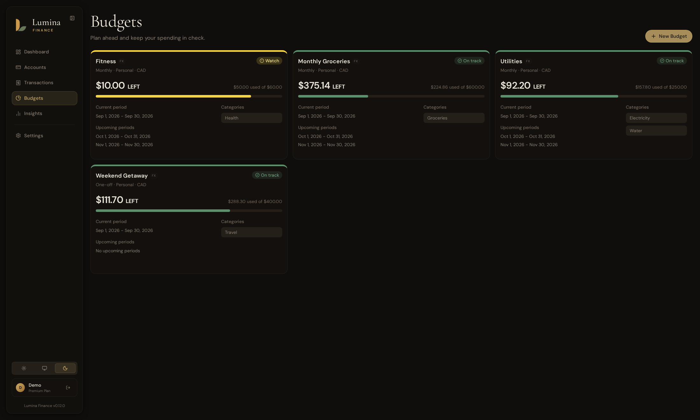
</p>

<p align="center">
  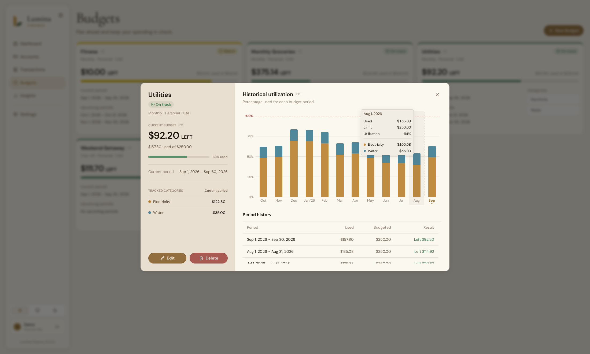
  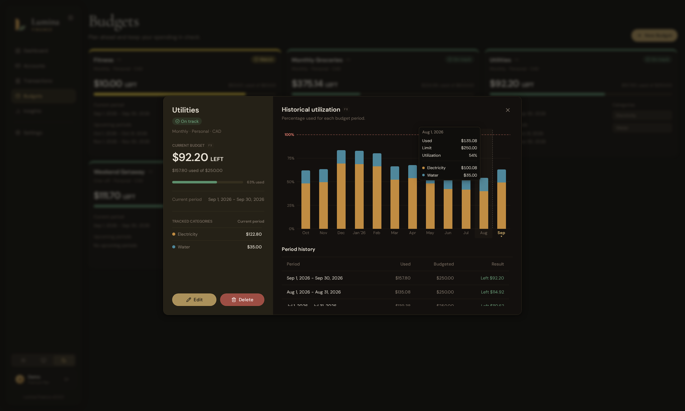
</p>

<p align="center">
  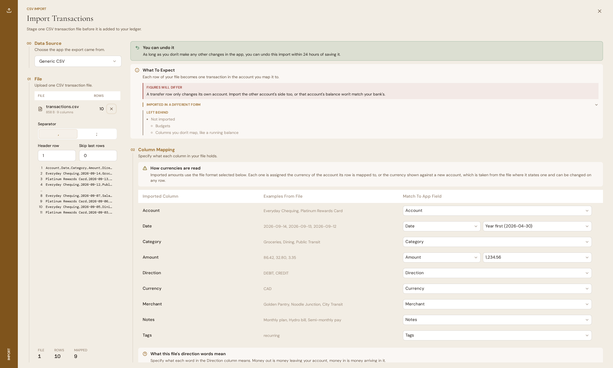
  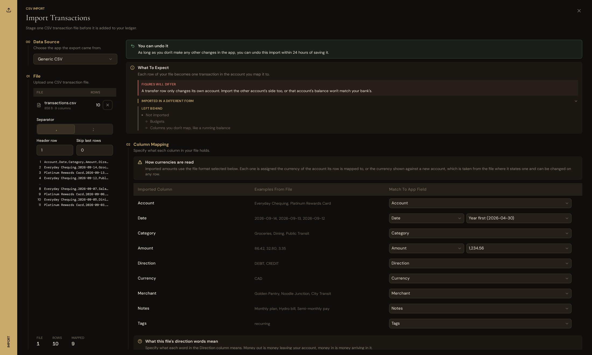
</p>

</details>

<!-- markdownlint-enable MD033 -->

## Self-hosting

<!-- markdownlint-disable MD033 -->
<a href="https://github.com/Lumina-Finance/lumina-finance/actions/workflows/pr.yml"></a>&nbsp;&nbsp;
<a href="https://github.com/Lumina-Finance/lumina-finance/actions/workflows/release.yml"></a>
<!-- markdownlint-enable MD033 -->

Lumina Finance runs with Docker Compose on a 64-bit host. Images are published for `linux/amd64` and `linux/arm64`.

To start a fresh instance with the example [compose file](docker/compose.yml) and [`.env`](docker/.env.example):

```sh
cd docker
cp .env.example .env
docker compose up -d
```

Set `DB_PASSWORD` in `.env` to a password of your own before the first start. The app is then available at `http://localhost:8080`. The [getting started guide](https://docs.luminafinance.co/self-hosting/getting-started/) covers the rest of the setup.

## Documentation

Setup, configuration and answers to common questions are on the docs site at [docs.luminafinance.co](https://docs.luminafinance.co):

- [Getting started](https://docs.luminafinance.co/self-hosting/getting-started/)
- [Environment variables](https://docs.luminafinance.co/self-hosting/environment-variables/)
- [Email](https://docs.luminafinance.co/self-hosting/email/)
- [Single sign-on](https://docs.luminafinance.co/self-hosting/single-sign-on/)
- [Rotating the encryption key](https://docs.luminafinance.co/self-hosting/encryption-keys/)
- [Signing keys and JWKS](https://docs.luminafinance.co/self-hosting/signing-keys/)
- [FAQ](https://docs.luminafinance.co/self-hosting/faq/)

## Support the project

Lumina Finance is fully bootstrapped. If you would like to support its development, please consider donating to the project.

<!-- markdownlint-disable MD033 -->
<a href="https://www.buymeacoffee.com/lumina.finance"></a>
<!-- markdownlint-enable MD033 -->

You can also show your support by starring the project on GitHub!

---

<!-- markdownlint-disable MD033 -->
<div align="center">
  <a href="https://www.star-history.com/?repos=Lumina-Finance%2Flumina-finance&type=date&legend=top-left">
    <picture>
      <source media="(prefers-color-scheme: dark)" srcset="https://api.star-history.com/chart?repos=Lumina-Finance/lumina-finance&type=date&theme=dark&legend=top-left&sealed_token=G8nGy5XJj7OX0x2gmytcpCaPGZQzG3mN10PijRfiU3ck66mFy916ZMC2lk6RQzPTVuxuLKDb5ludxBinqLypUB_C9dtNwIbulbsIOlnn8SU0iySjcHLZrA" />
      <source media="(prefers-color-scheme: light)" srcset="https://api.star-history.com/chart?repos=Lumina-Finance/lumina-finance&type=date&legend=top-left&sealed_token=G8nGy5XJj7OX0x2gmytcpCaPGZQzG3mN10PijRfiU3ck66mFy916ZMC2lk6RQzPTVuxuLKDb5ludxBinqLypUB_C9dtNwIbulbsIOlnn8SU0iySjcHLZrA" />
      
    </picture>
  </a>
</div>
